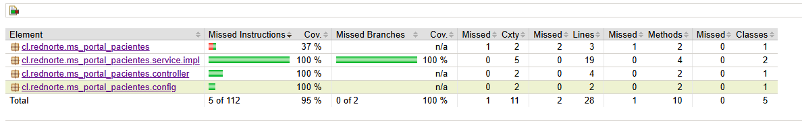

# MS Portal Pacientes

Microservicio Portal de Pacientes para Red Norte. Expone endpoints públicos
(sin autenticación) para que los pacientes consulten el estado de sus
solicitudes de atención usando su RUT.

## Tecnologías

- **Java 21**
- **Spring Boot 3.5.14**
- **Maven**
- **Lombok**
- **JUnit 5 + Mockito** (pruebas unitarias)
- **JaCoCo** (cobertura de código)

## Endpoints

| Método | Ruta | Descripción |
|--------|------|-------------|
| GET | `/solicitudes?rutPaciente={rut}` | Lista las solicitudes de un paciente (paginado) |
| GET | `/solicitudes/{id}?rutPaciente={rut}` | Detalle de una solicitud específica con historial |

> El microservicio no tiene base de datos propia. Consume el MS Lista de Espera
> vía RestTemplate y reexpone los datos en DTOs específicos del portal.

## Ejecutar Unit Tests

Para ejecutar las pruebas unitarias:

```bash
./mvnw clean test
```

## Reporte de Cobertura de Código (JaCoCo)

El proyecto incluye JaCoCo configurado para generar reportes de cobertura de código.

### Cobertura Actual



**Métrica de Cobertura:**
- **Líneas cubiertas**: 95%
- **Clases cubiertas**: 100%
- **Métodos totales**: 10 (1 no cubierto)

### Generar Reporte

El reporte se genera automáticamente al ejecutar:

```bash
./mvnw clean test
```

El reporte HTML interactivo se encuentra en: `target/site/jacoco/index.html`

## Estructura del Proyecto

```
src/
├── main/
│   ├── java/
│   │   └── cl/rednorte/ms_portal_pacientes/
│   │       ├── config/
│   │       ├── controller/
│   │       ├── dto/
│   │       └── service/
│   └── resources/
└── test/
    └── java/
        └── cl/rednorte/ms_portal_pacientes/
            ├── controller/
            │   └── PortalPacientesControllerTest.java
            └── service/impl/
                └── PortalPacientesServiceImplTest.java
```

## Pruebas Unitarias

Total de tests: **13**

### Enfoque

Las pruebas siguen el patrón **Given/When/Then** documentado en cada método,
y están organizadas por capa:

- **Controller** (`PortalPacientesControllerTest`): valida el contrato HTTP
  del endpoint usando `@WebMvcTest`, que carga el slice de Spring MVC y
  refleja el comportamiento real (códigos HTTP, formato JSON, `@ControllerAdvice`).
- **Service** (`PortalPacientesServiceImplTest`): valida la lógica de
  comunicación con MS Lista de Espera (vía `RestTemplate` mockeado) usando
  Mockito puro con `@ExtendWith(MockitoExtension.class)`.

### Sobre `@MockitoBean`

Los tests del controller usan `@MockitoBean` en lugar de `@MockBean` (deprecated
desde Spring Boot 3.4, noviembre 2024). Esta es la anotación oficial de Mockito
para reemplazar beans de Spring en tests, y vive en el paquete
`org.springframework.test.context.bean.override.mockito`.

### Escenarios cubiertos

**Controller (5 tests):**
- ✅ Listado exitoso con paciente identificado por RUT
- ✅ Listado sin parámetro `rutPaciente` → 400 Bad Request
- ✅ Forwarding de parámetros de paginación al service
- ✅ Detalle de solicitud existente
- ✅ Detalle de solicitud inexistente → 404 Not Found

**Service (7 tests):**
- ✅ Listado exitoso desde el RestTemplate
- ✅ Listado con body null → comportamiento documentado
- ✅ Construcción correcta de URL con `rutPaciente`, `page` y `size` (con `ArgumentCaptor`)
- ✅ Listado lanza 503 cuando el servicio externo falla
- ✅ Detalle exitoso del RestTemplate
- ✅ Detalle 404 cuando RestTemplate retorna null
- ✅ Detalle 503 cuando el servicio externo falla

**Integration:**
- ✅ Context loads del ApplicationContext de Spring Boot
